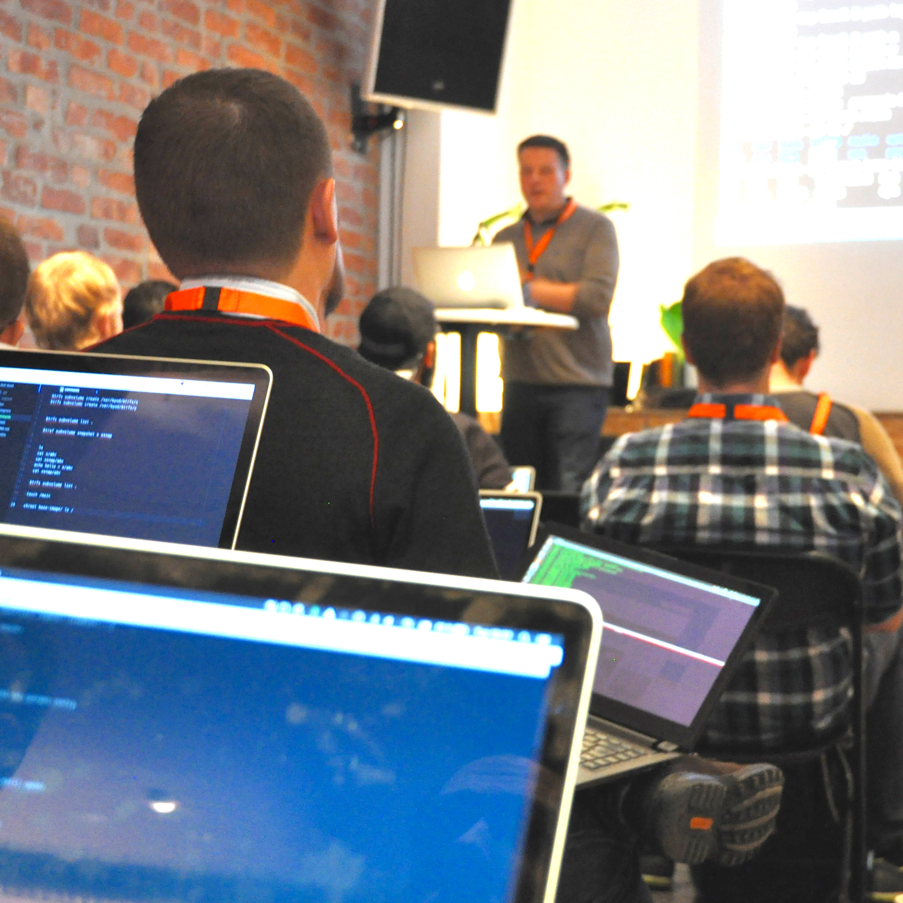
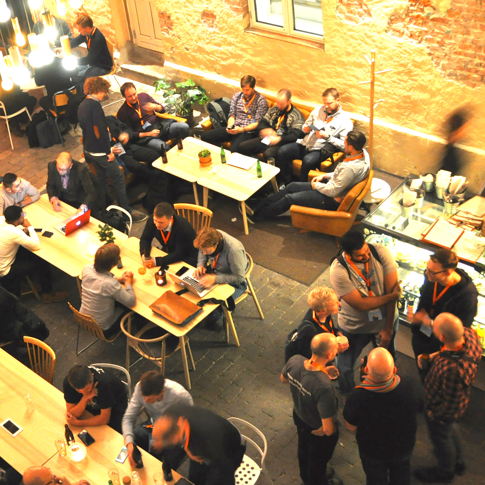
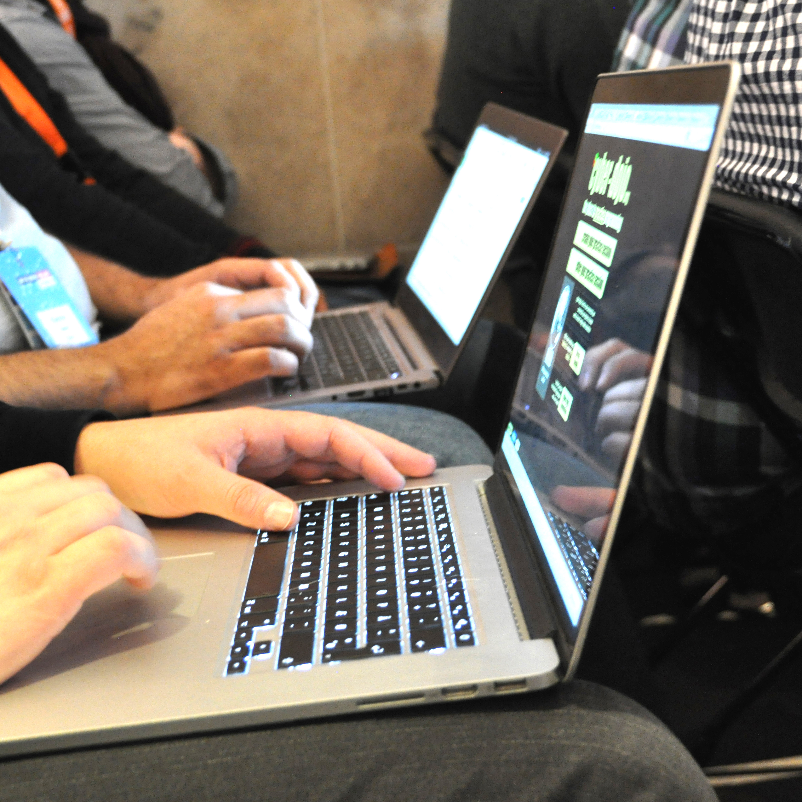
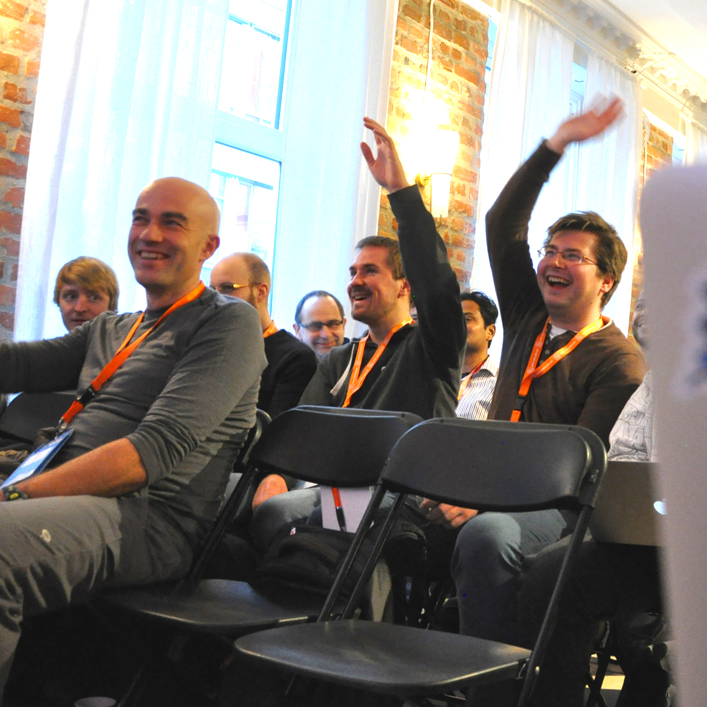



 

{% include columns.html 
column_number=3
content="

{: .image}

## *Co*{: style='color: orange; font-style: normal;'}ntinuous *De*{: style='color: orange; font-style: normal;'}livery  Academy
So you’re a student in the field of Computer Science — cool! But still, you get that sinking feeling that you’re missing out on important best practices of the modern era of Continuous Delivery and DevOps?
<!--col-->

{: .image}

## It’s free.  Honestly
Students are offered a free seat at the code academy! The only catch is that each day there will be a pitch from one of the sponsors about their company. But then again, they’re only here to recruit, so it makes sense right? But seriously, the lunch will be free.
<!--col-->

{: .image}

## Learn  the latest skills
Five days of intense hands-on continuous delivery training. A primer on Agile teaching you to groom tasks. Advanced version control with Git. Build and test automation with Jenkins. Test Driven Development to build quality in! Build, Ship, Run with Docker.
"
%}

{% include columns.html 
column_number=2
content="

{: .image}

## But why?
Here’s the thing — demand for Continuous Delivery and DevOps skills is far outstripping what is available in the job market. We at Praqma are feeling this most acutely. So we thought: “Why do we only train our new recruits? Why not train everyone looking for work! So that not only Praqma employees get these skills but all people entering the industry?”
<!--col-->

{: .image}

## Supporters
Each location will have five companies supporting the academy. Companies are looking to recruit in this field — you’ll be given a pitch by each one of them. Each Academy season has a set of technology sponsors as well. They are just happy to support the Continuous Delivery and DevOps revolution — and throw you swags.
"
%}



 



 



 



 


