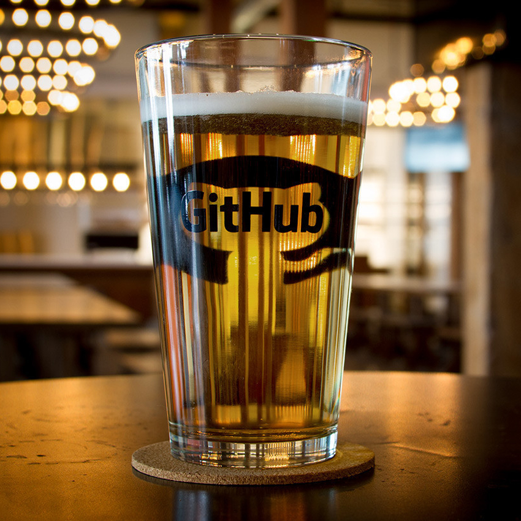
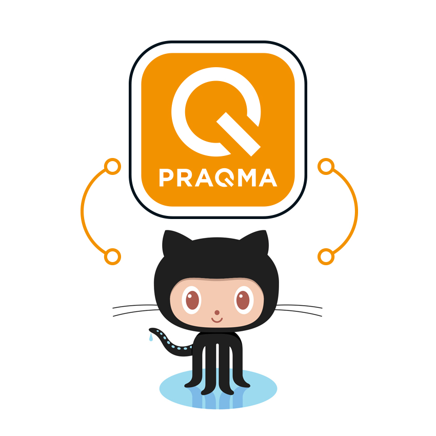



{% include meetup/summary.html
content="
## For forward-thinking software executives

GitHub and Praqma have entered into partnership in Scandinavia - we believe it’s a perfect
match, come and hear why! We’re jointly inviting you to a breakfast-to-lunch seminar of
three short workshops that will give you insight on how businesses are transforming by
building methodologies and practices that will drive software development into the future.

The event will be held in Copenhagen on June 22nd with the doors opening at 8.45am.
Location Lysthuset, Islands Brygge 18, 2300 København S."
button_link=page.button_link
button_text="Join us now!"
image="/images/pages/meetups/summary.jpg"
image_alt=page.title

color=page.color
date=page.date_
date_end=page.date_end
time=page.time
city=page.city
%}

 







 



{: .image}

## GitHub Enterprise Power of Community
{: .marker .workshop-header}
Power of Code. On Premises
{: .workshop-text}

<!--col-->

{: .image}

## Praqmatic Workflow
{: .marker .workshop-header}
An agile task approach. Powered by GitHub Issues
{: .workshop-text}
<!--col-->

{: .image}

## Your road to the future
{: .marker .workshop-header}
Create a roadmap for DevOps transformation with Praqma’s CoDe Assessment
{: .workshop-text}









