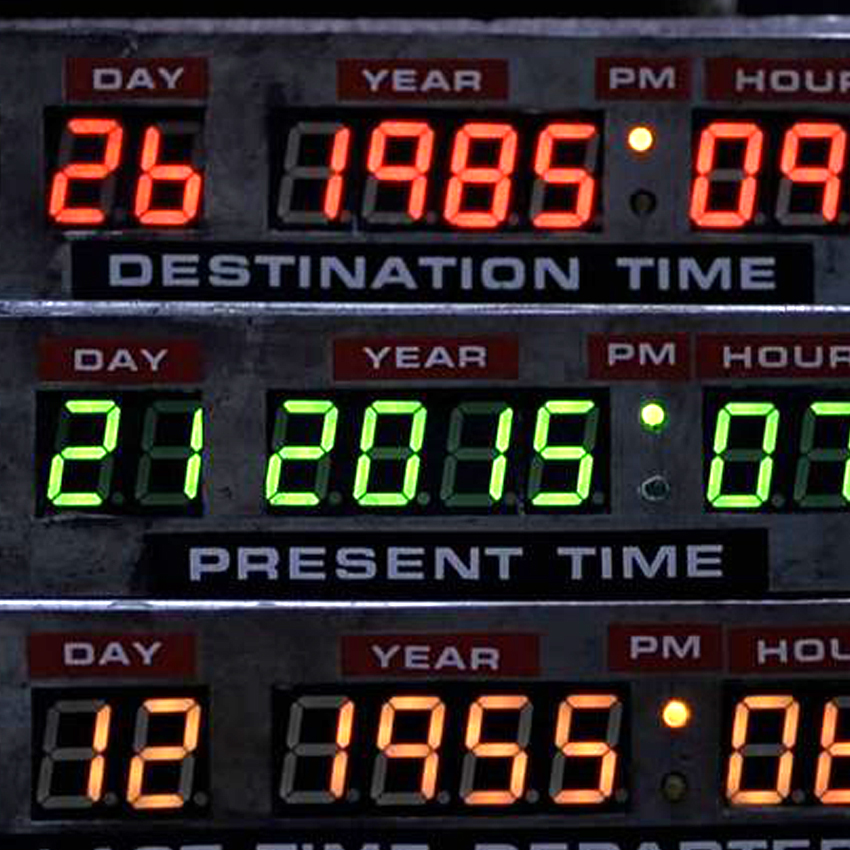



{% include meetup/summary.html
content="
GitHub and Praqma have entered into partnership in Scandinavia - we believe it’s a perfect
match, come and hear why! We’re jointly inviting you to a breakfast-to-lunch seminar of
three short workshops that will give you insight on how businesses are transforming by
building methodologies and practices that will drive software development into the future.

The event will be held in Copenhagen on June 22nd with the doors opening at 8.45am.
Location Lysthuset, Islands Brygge 18, 2300 København S."
button_link=page.button_link
button_text="Join us now!"
image="/images/pages/meetups/summary.jpg"
image_alt=page.title

color=page.color
date=page.date_
date_end=page.date_end
time=page.time
city=page.city
%}

 

AGENDA
---

**8.45 – 9.15**  Breakfast & Networking

**9.15 – 9.25**  Welcome by Praqma

**9.25 – 9.45**  Next Gen Software Development by GitHub

**9.45 – 11.15** Three Workshops to Engage & Learn

Each workshop is 30 mins - and we will rotate - so you’ll get to attend all three of them
**11.15** Lunch is served

Having attended this seminar, you’ll have more insight on how your company can:

* Attract and retain new talent
* Ship code faster
* Compete smarter

 

Workshops
---




{{ workshops }}





What are you waiting for? [Join us now!](https://ti.to/github-events/copenhagen-breakfast-seminar){:.btn .btn-primary style="background: {{ page.color }}; border-color: {{ page.color }};" target="_blank"}
