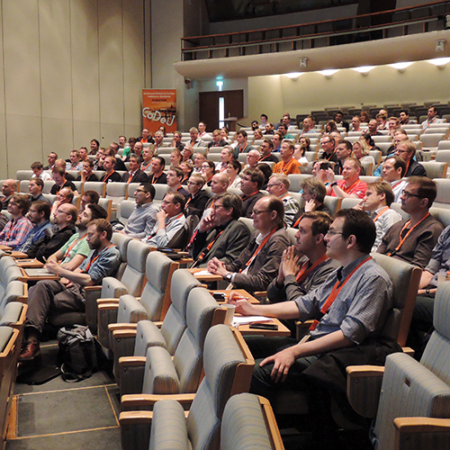
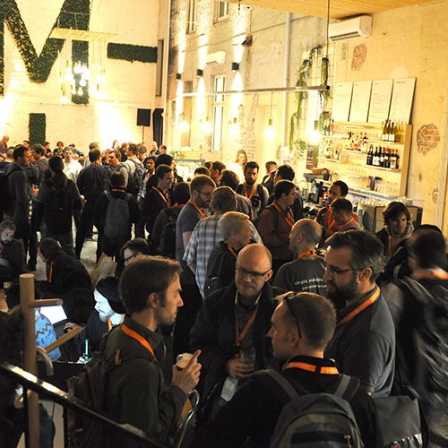
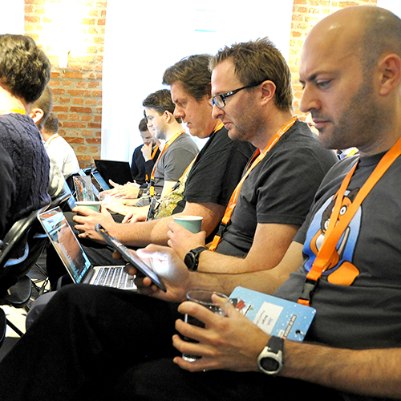
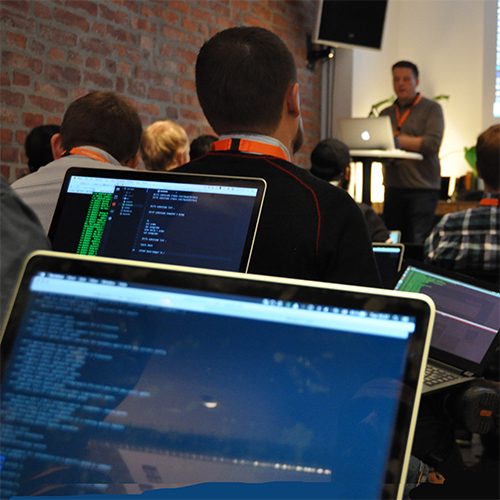







{% include columns.html
column_number=4
content="

{: .image}

## Conferences
We host conferences on Continuous Delivery all year round. Sign up and join us.
<!--col-->

{: .image}

## Meet-Ups
CoDe communities are emerging all over Scandinavia. Find one near you.
<!--col-->

{: .image}

## Training
Get up to speed with our courses on CoDe, Atlassian, Git, Docker & Jenkins.
<!--col-->

{: .image}

## Hackathons
Informal gatherings where we exchange ideas and do some coding. Just bring your brain and your laptop.
"
%}







